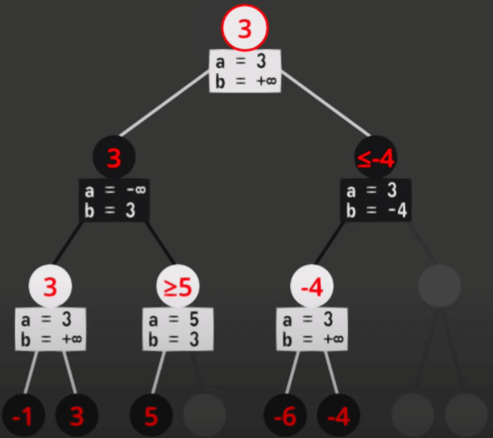

# Alpha-Beta Pruning

Alpha-Beta pruning is an optimization technique that reduces the number of nodes
visited for MiniMax.

**Alpha** is the best value that the maximizer can currently guarantee for that
level or above.

**Beta** is the best value that the minimizer can currently guarantee for that
level or above.

The pseudocode for the algorithm will be:

```
function minimax(node, depth, maximizingPlayer, alpha, beta) {
  if depth = targetDepth or node is a terminal then
    return heuristicValue(node, depth)
  if maximizingPlayer then
    bestValue = −Infinity
    for each child of node:
      bestValue = max(bestValue, minimax(child, depth + 1, FALSE, alpha, beta))
      alpha = max(alpha, bestValue)
      if beta <= alpha:
        break
    return bestValue
  else
    bestValue := +Infinity
    for each child of node do
      bestValue = min(bestValue, minimax(child, depth + 1, TRUE, alpha, beta))
      beta = min(beta, bestValue)
      if beta <= alpha:
        break
    return bestValue
}

minimax(root, 0, TRUE, −Infinity, +Infinity)
```


